## Introduction

Portfolio Project 4 - Waves. This project is a Full-Stack website using the Django framework to build. Waves is a health and fitness website with sea and wellness theme where users can view stunning landscapes and join the community of like-minded people. Users can view posts, comments and the gallery, while registered users can upload posts, create comments and like posts/comments.

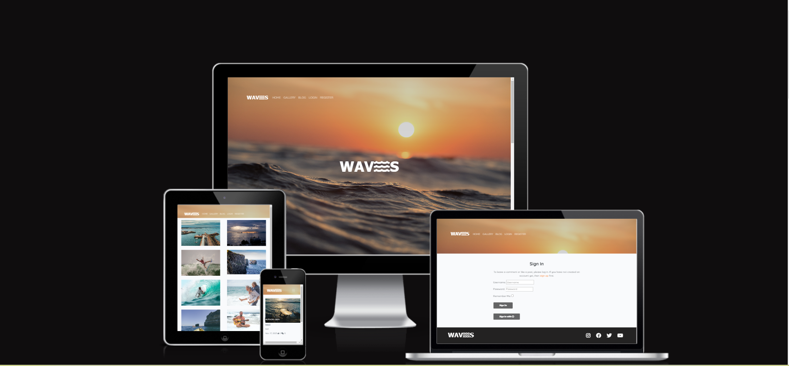
   
## Contents

- [Introduction](#introduction)
  - [CONTENTS](#contents)
  - [Site Objectives](#site-objectives)
- [User Experience/UX](#user-experienceux)
  - [Target Audience](#target-audience)
  - [User Stories](#user-stories)
    - [New Visitor Goals](#new-visitor-goals)
    - [Existing Visitor Goals](#existing-visitor-goals)
- [Design Choices](#design-choices)
  - [Colour Scheme](#colour-scheme)
  - [Typography](#typography)
  - [Favicon](#favicon)
  - [Wireframes](#wireframes)
  - [Flow Diagram](#flow-diagram)
  - [Database Plan](#database-plan)
- [Features](#features)
  - [Registration](#registration)
  - [Future Features](#future-features)
  - [Features Not Included](#features-not-included)
- [Technologies Used](#technologies-used)
- [Programming Languages, Frameworks and Libraries Used](#programming-languages-frameworks-and-libraries-used)
- [Agile](#agile)
- [Testing](#testing)
  - [Manual Testing](#manual-testing)
  - [User](#user)
  - [Bugs](#bugs)
  - [Lighthouse](#lighthouse)
  - [Validation Testing](#validation-testing)
    - [HTML \& CSS](#html--css)
  - [Python Testing](#python-testing)
  - [Deployment](#deployment)
    - [Github Deployment](#github-deployment)
    - [Creating a Fork or Copying](#creating-a-fork-or-copying)
    - [Clone](#clone)
    - [Repository deployment via Heroku](#repository-deployment-via-heroku)
    - [Deployment of the app](#deployment-of-the-app)
  - [Credits](#credits)
  - [Media](#media)
  - [Acknowledgments](#acknowledgments)

___

## Site Objectives

Design and create a blog site to demonstrate an increasing understanding of the libraries and frameworks available to developers.

My three main objectives were:

- ### Develop an Engaging and Responsive User Interface

    The objective was to craft a visually appealing and user-friendly interface. Leveraging the power of Django and Bootstrap, the aim was to ensure readability and ease of navigation for all users.

- ### Implement Robust Backend Functionality

  Utilizing the capabilities of the backend framework, the project aimed to provide users with a seamless experience. Users, whether authenticated through all-auth or alternative methods, could explore posts, comments, and a gallery of images. Additionally, they were empowered to create, edit, and delete their own posts and gallery images.

- ### Utilize External Cloud Database for Data Storage

  To ensure efficient data management, ElephantSQL was employed as the external cloud database, specifically handling the PostgreSQL database for the project. This decision was made to enhance scalability and data accessibility.

By achieving these objectives, the project aimed to showcase an adept understanding of various libraries and frameworks available to developers, delivering a comprehensive and dynamic blog platform.

___

# User Experience/UX

## Target Audience

- Users that are interested in surf, sea and overall wellbeing.

## User Stories

### New Visitor Goals

- Gain a clear understanding of the website's purpose and content.
- Navigate the site effortlessly to explore its features and offerings.
- Create an account to actively engage with the content, other users, and the site owner.

### Existing Visitor Goals

- Log in and out of their account seamlessly.
- Read insightful blog posts, comments and explore the site's gallery.
- Express their views by liking, creating posts, and adding insightful comments to blog posts. Additionally, users can actively participate in the creation, editing, and liking of gallery images.

___

# Design Choices

## Colour Scheme

The chosen color scheme for this project mirrors the vibrant hues of the site's banner, capturing the essence of a sunset atop a rolling wave. The palette exudes warmth to encapsulate the sun's radiance, coupled with subtle tones of darkness to signify the shadow cast, and touches of white to convey the transparent and fluid nature of water.

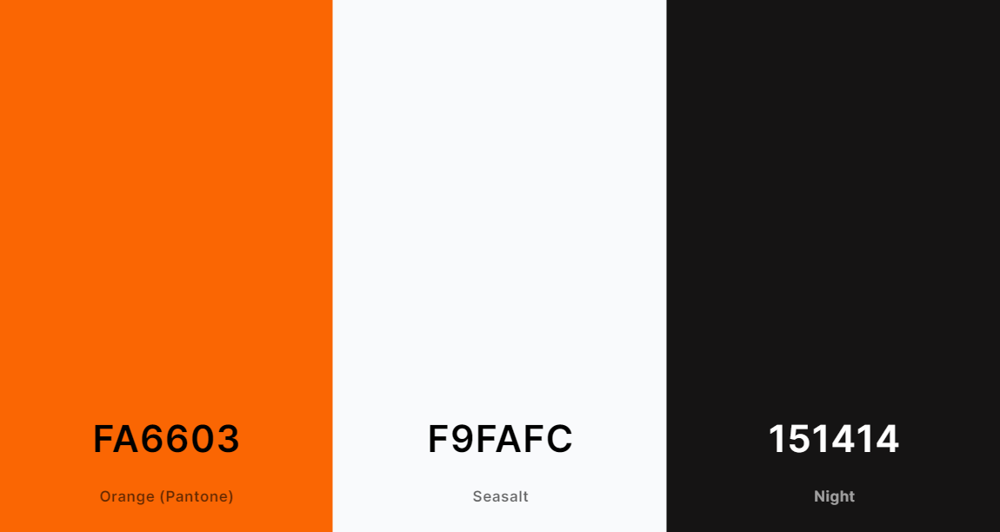

## Typography

The main font used is Quicksand, but Tahoma was used for the main logo appears and the call to action buttons.

## Wireframes

- Mobile Homepage Wireframe

- Mobile Post Detail Wireframe

- Desktop Homepage Wireframe

- Desktop Post Detail Wireframe

## Flow Diagram

### Admin Flowchart

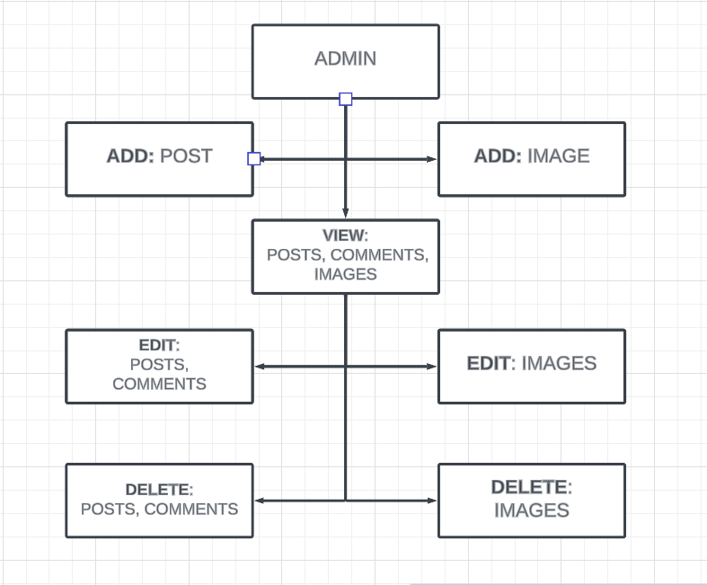

### User Flowchart

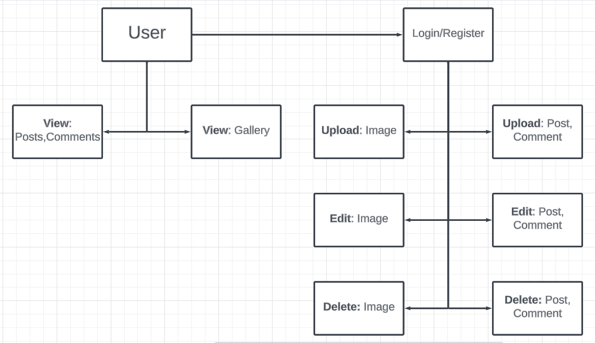

## Database Plan

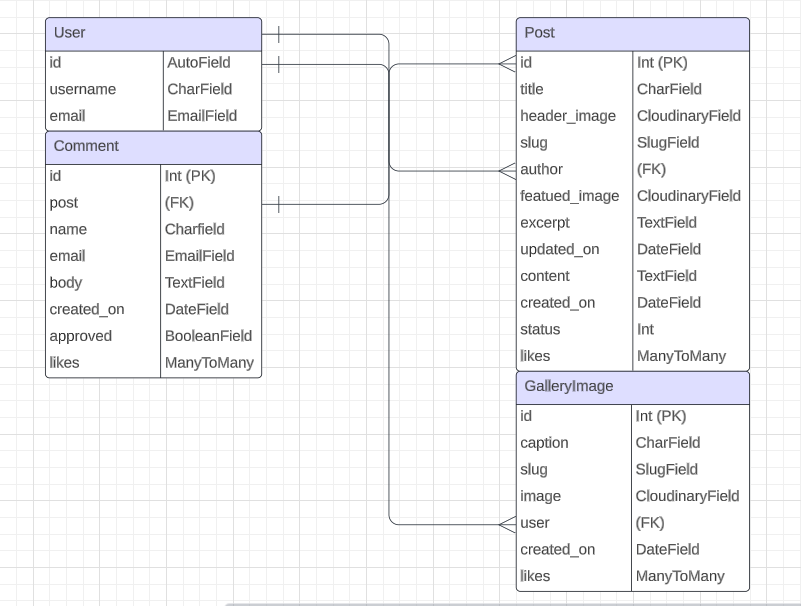

# Features

### Home Page Top

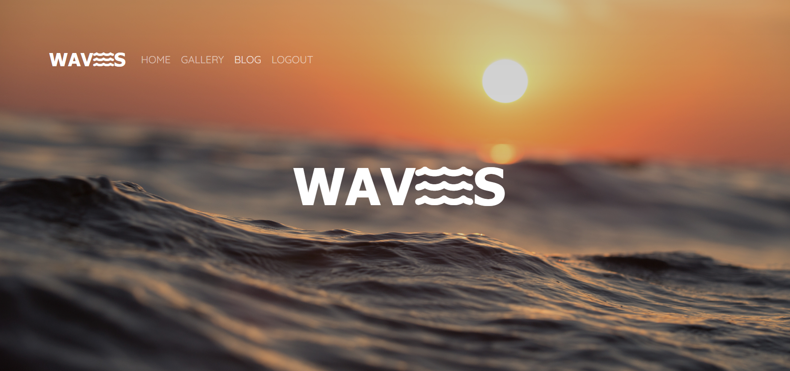

#### Logo Section:

- Displays the WAVES logo in a visually appealing manner.
- Utilizes a water-themed font and iconography to reinforce the ocean theme. 

 #### Navigation Bar:

- Provides easy navigation with links to the Home, Gallery, and Blog sections.
- Dynamically adjusts for user authentication, showing login and registration options when the user is not logged in, and logout when they are.

### Home Page Bottom

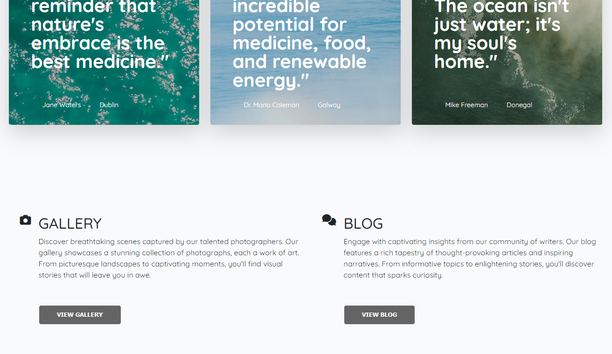

#### Testimonial Cards:

- Presents testimonials from individuals with immersive background images.
- Each card includes a compelling quote, the speaker's name, and their location for authenticity.

 ####  Hanging Icons Section:

- Highlights key sections (Gallery and Blog) with icons and informative text.
- Provides a brief description of each section's content and encourages users to explore further.

### Footer

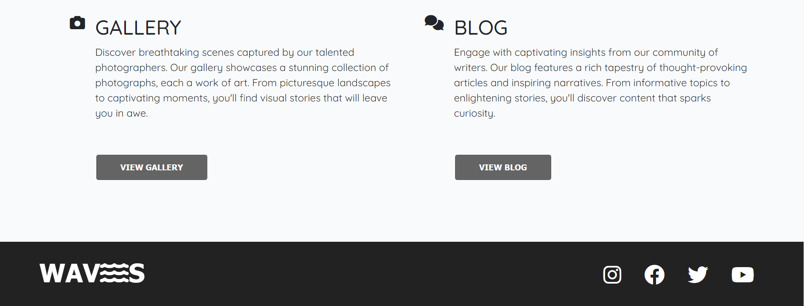

#### Footer:

- Contains closing information and links.

### Gallery

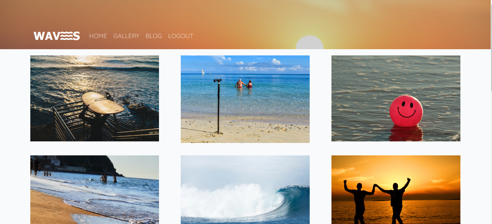

#### Thumbnail Grid:

- Dynamically generates a responsive grid of gallery images.
- Iterates through the list of galleryimage_list and displays each image in a card-like structure.

 #### Overlay

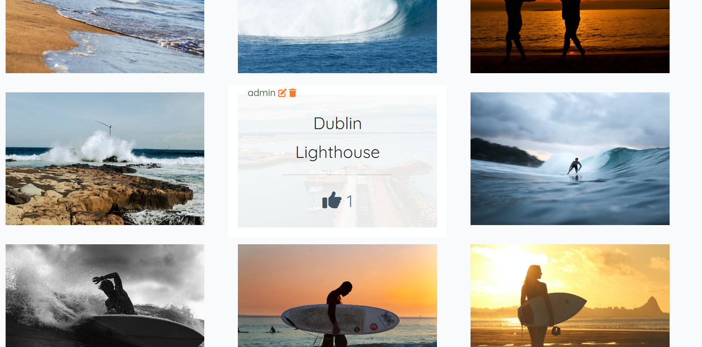

- Presents an overlay on each image with a caption, user information, and interactive buttons.
- The "Like" button allows users to express appreciation, and the count updates dynamically.
- Provides quick access to edit and delete functionalities for each image.

#### Gallery Pagination & Upload

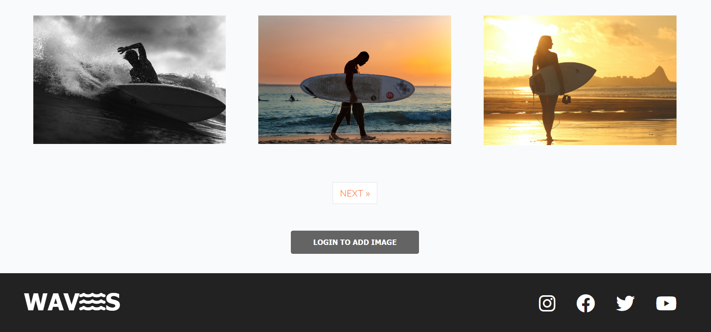

- If the gallery is paginated, a navigation bar is included for easy movement between pages.
- Displays a button to upload new images, guiding users to contribute to the gallery.
- If the user is not logged in, encourages them to log in before contributing.

### Upload Image Page

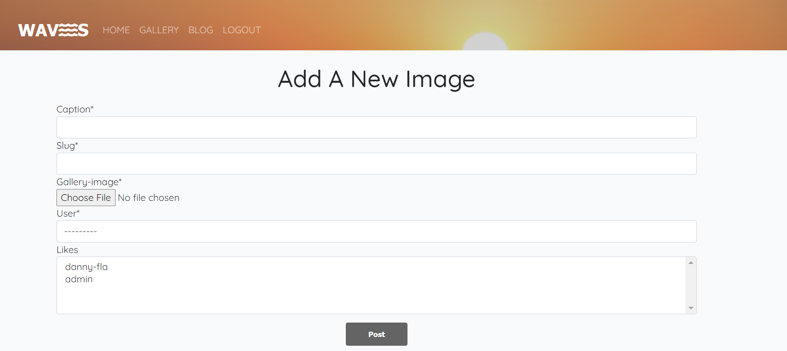

- Displays the "Add A New Image" title, indicating that the form is for creating a new image entry.
- Renders a form for adding a new image entry.
- Displays input fields for providing information about the new image.
- Includes a "Post" button for submitting the new image details.

### Edit Image Page

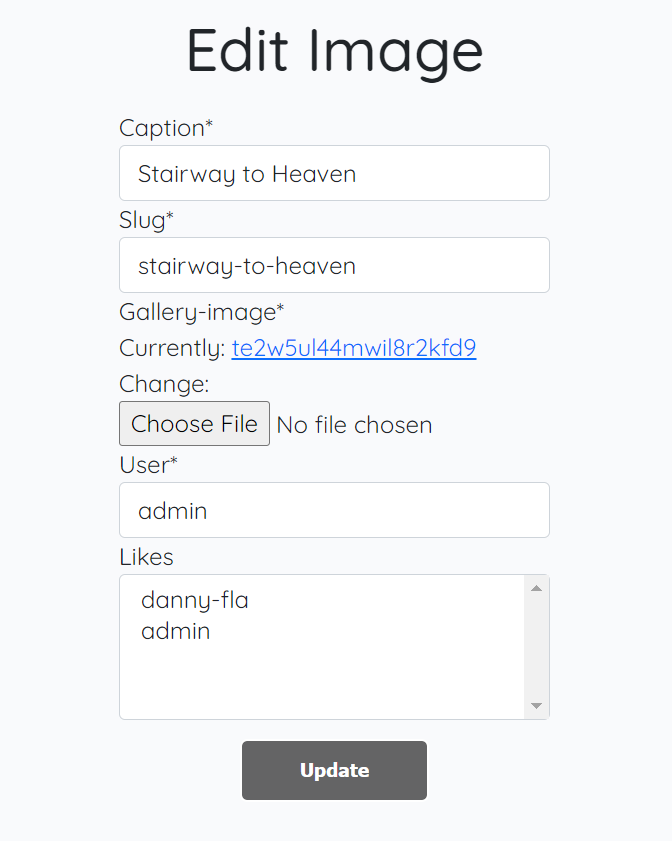

- Displays the "Edit Image" title, indicating that the form is for editing an existing image.
- Renders a form for editing image details.
- Displays input fields for updating image information.
- IIncludes a "Update" button for submitting the edited image details.

### Delete Image Page

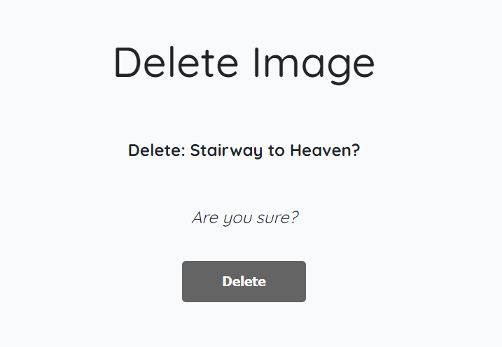

- Displays the "Delete Image" title, indicating the purpose of the page.
- Displays the Image title for reference.
- Presents a form for confirming the deletion of the image.
- Provides a "Delete" button for submitting the deletion request.

### Blog List

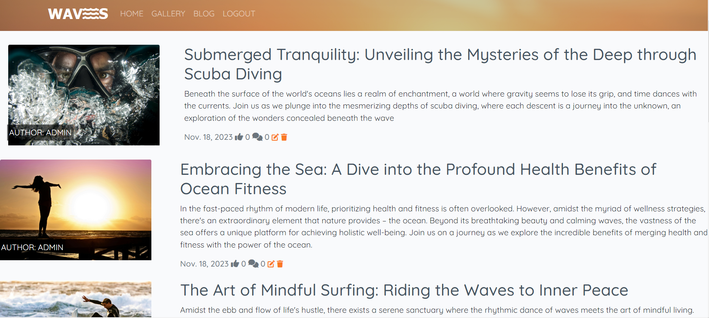

- Utilizes a featurette layout to display blog posts in an engaging and visually appealing 
- Each post is presented in a separate container, allowing for a clear distinction between different posts.
- Features the post's featured image (or a placeholder if not available) along with the post title.
- Utilizes an image container to house the featured image, ensuring a consistent and visually pleasing display.
- Includes a flash overlay displaying the author's name.
- Presents the post's excerpt, creation date, number of likes, and comments.
- Incorporates icons for thumbs-up (likes) and speech bubble (comments).
- Offers edit and delete links for authenticated users who are the authors of the respective posts.

 #### Blog Pagination & Upload:

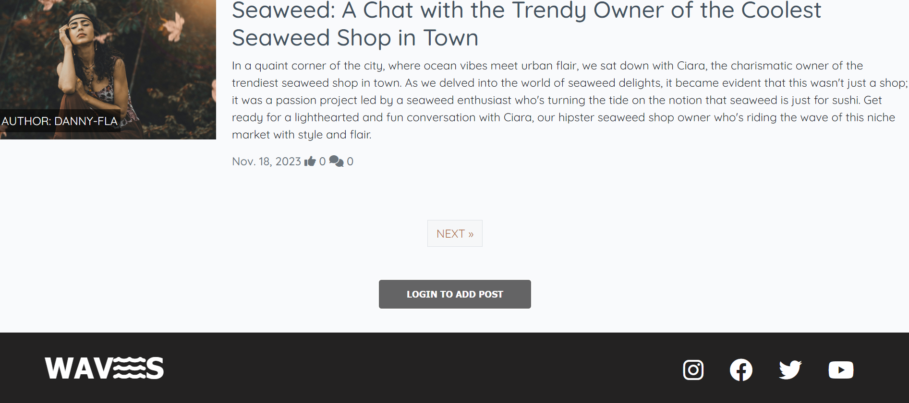

- If the blog list view is paginated, a navigation bar is included for easy movement between pages.
- Displays a button to upload new posts, guiding users to contribute to the blog.
- If the user is not logged in, encourages them to log in before contributing.

### Post Detail Page:

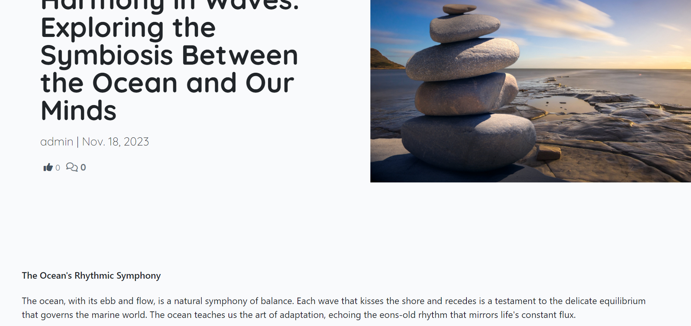

- Uses a responsive header section with a background image or color.
- Displays the post's featured image, providing a visual representation of the content.
- Presents essential information about the post, including the title, author, creation date, and social engagement buttons.
- The like button has a dynamic state (liked or not liked), and the count updates accordingly.
- The main content section is organized into rows and columns for a structured layout.

#### Comment Section:

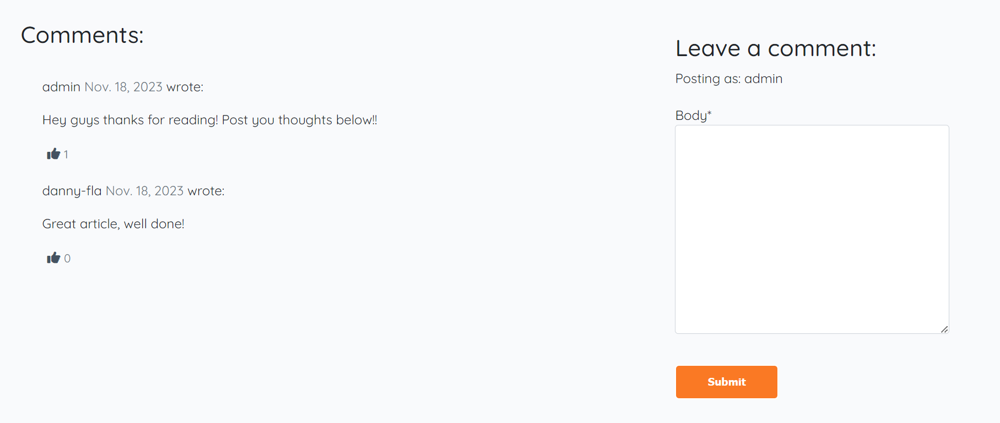

- Displays comments in a separate column, allowing for a clear distinction from the post content.
- Each comment is presented with the commenter's name, timestamp, and body.
- The like button is provided for each comment, with a dynamic state (liked or not liked) and an updated like count.
- Authenticated users see a form to submit comments, including the user's username and a submission button.
- Users are informed if their comment is awaiting approval (commented) or prompted to leave a comment.

### Upload Post Page

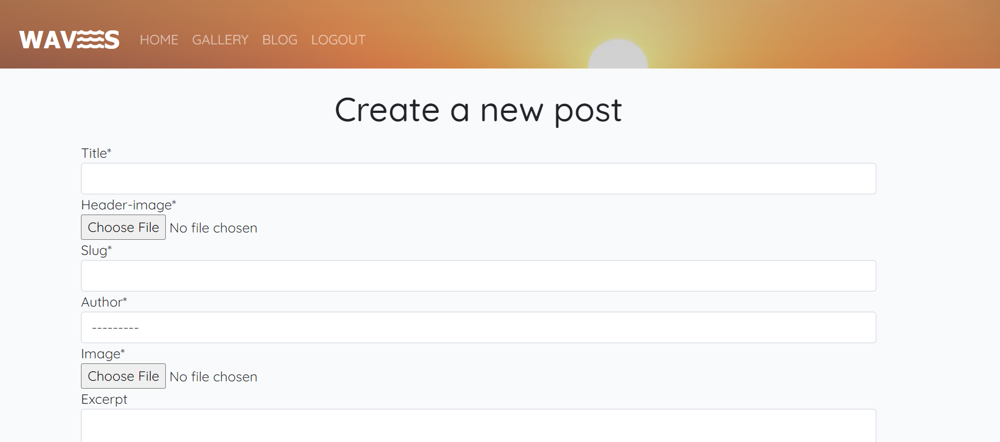

- Displays the "Create a new post" title, indicating that the form is for creating a new blog post.
- Renders a form for creating a new blog post.
- Provides input fields or text areas for entering the content of the new post.
- Includes a "Post" button for submitting the new post.

### Edit Post Page

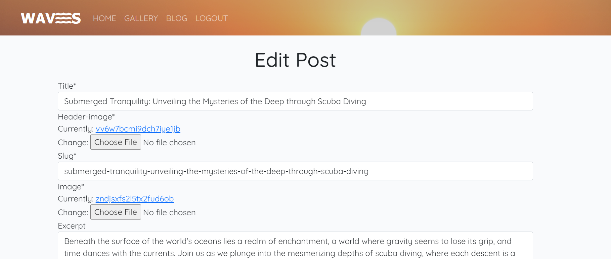

- Displays the "Edit Post" title if the authenticated user is the author of the post.
- Renders an edit form for updating the post's content.
- Provides a text area or input fields for modifying the post content.
- Includes a "Update" button for submitting the edited content.

### Delete Post Page

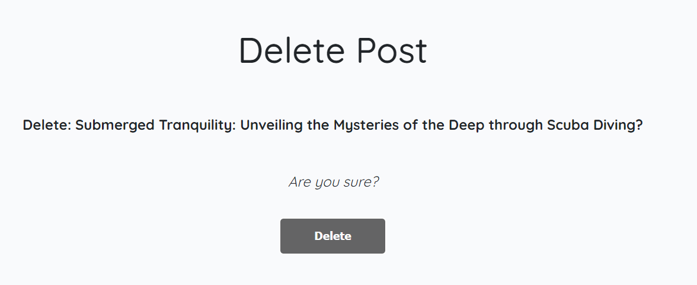

- Displays the "Delete Post" title, indicating the purpose of the page.
- Displays the post title for reference.
- Presents a form for confirming the deletion of the post.
- Provides a "Delete" button for submitting the deletion request.

### Sign in Page

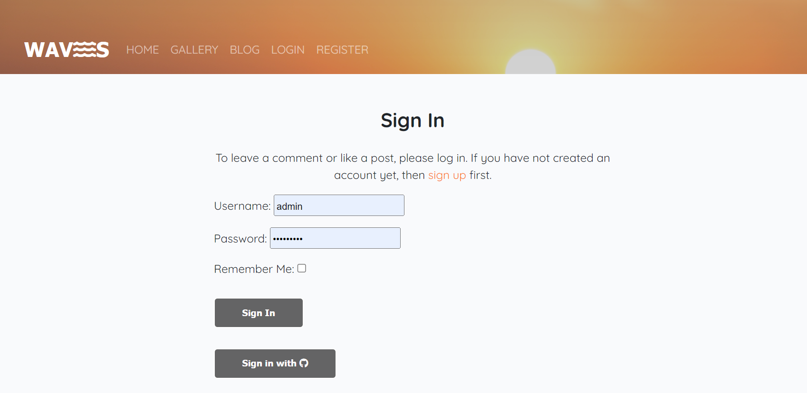

- Displays a heading "Sign In" at the center of the container.
- Presents a form with the ID "login_form" for user login.
- The "Sign In" button triggers form submission.
- Displays a button that allows users to sign in with GitHub using the OAuth2 method.

### Sign in Page

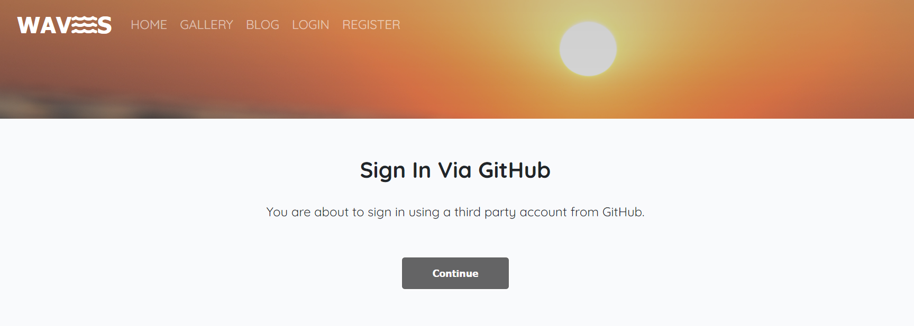

- Displays a heading at the center of the container, dynamically generated based on the third-party provider name.
- Provides a text paragraph informing the user about the action they are about to perform (connecting or signing in) and mentions the third-party provider.
- The form allows the user to continue the sign-in or connection process.

## Future Features

#### Subscription and Newsletter:

- Allow users to subscribe to the blog for updates.
- Implement a newsletter system for regular content distribution.

#### E-commerce Integration:

- Add an e-commerce section for selling products related to the blog.
___

# Technologies Used

Here are the technologies used to build this project:

- [GitPod](https://gitpod.io/) To build and create this project
- [Github](https://github.com) To host and store the data for the site.
- [GitPod](https://www.gitpod.io) the IDE where the site was built.
- [PEP8 Validator](https://pep8ci.herokuapp.com/) Used to check python code for errors
- [ElephandSQL](https://www.elephantsql.com/) Used to store PostgreSQL database.
- [Cloudinary](https://cloudinary.com/) Used as cloud storage for images uploaded as part of the blog posts
- [Heroku](https://id.heroku.com/) Used to deploy the project

# Programming Languages, Frameworks and Libraries Used

- [HTML](https://developer.mozilla.org/en-US/docs/Web/HTML)
- [CSS](https://developer.mozilla.org/en-US/docs/Learn/Getting_started_with_the_web/CSS_basics)
- [Python](https://en.wikipedia.org/wiki/Python_(programming_language))
- [Django](https://www.djangoproject.com/)
- [Bootstrap](https://getbootstrap.com/)

# Agile

This project was designed using Agile methodology, utilising the Project Board and Issues sections in GitHub

- [Project Board](https://github.com/users/danny-fla/projects/5/views/1)

# Testing

Throughout the course of this project, as individual sections, functions, or models were developed, I performed comprehensive testing to detect and rectify any issues related to functionality or styling (refer to the table below). Immediate corrections or fixes were applied before progressing further. Furthermore, I sought the support of friends to conduct thorough site testing. They actively participated in activities like sign-ups and the creating/updating/ deleting of posts, comments, gallery using diverse devices and platforms such as IOS, Android, mobile phones, tablets, etc. Any concerns reported regarding functionality or styling underwent meticulous review and resolution.

## Manual Testing

## ADMIN

#### Login and Authentication:

| TEST | EXPECTED OUTCOME | PASS/FAIL|
|:---:|:---:|:---:|
|Log in with valid admin credentials.|Successful login, and the admin dashboard is displayed.|Pass|
| Log in with invalid credentials.|Appropriate error message displayed.|Pass|

#### Post Management:

| TEST | EXPECTED OUTCOME | PASS/FAIL|
|:---:|:---:|:---:|
| Create a new blog post.|Post is successfully created and listed in the admin interface.|Pass|
|Edit an existing blog post.|Changes are saved, and the post is updated.|Pass|
| Delete a blog post.|Post is removed from the system.|Pass|
|Like a post|The like count is incremented, and the user's like is recorded.|Pass|
|Unlike a post.|The like count is decremented, and the user's like is removed.|Pass|

#### Comment Management:

| TEST | EXPECTED OUTCOME | PASS/FAIL|
|:---:|:---:|:---:|
|View a list of comments.| All comments are displayed in the admin interface.|Pass|
| Approve a pending comment.|Comment status changes to approved.|Pass|
|Delete a comment.|Comment is removed from the system.|Pass|
|Like a comment|The like count is incremented, and the user's like is recorded.|Pass|
|Unlike a comment.|The like count is decremented, and the user's like is removed.|Pass|

####  Gallery Management:

| TEST | EXPECTED OUTCOME | PASS/FAIL|
|:---:|:---:|:---:|
|Upload a new image to the gallery.| Image is successfully uploaded and listed in the admin interface.|Pass|
| Edit details of an existing gallery image.|Changes are saved, and the image details are updated.|Pass|
|Delete a gallery image.|Image is removed from the system.|Pass|
|Like a gallery image.|The like count is incremented, and the user's like is recorded.|Pass|
|Unlike a gallery image.|The like count is decremented, and the user's like is removed.|Pass|

#### User Management:

| TEST | EXPECTED OUTCOME | PASS/FAIL|
|:---:|:---:|:---:|
|View a list of users.|All users are displayed in the admin interface.|Pass|
|Edit user details.| Changes are saved, and user details are updated.|Pass|
|Suspend a user account.|User account is suspended.|Pass|

#### Settings

| TEST | EXPECTED OUTCOME | PASS/FAIL|
|:---:|:---:|:---:|
| Modify general site settings.|Changes are saved, and settings are updated.|Pass|
|Change the admin password.|Password is successfully updated.|Pass|

#### Security

| TEST | EXPECTED OUTCOME | PASS/FAIL|
|:---:|:---:|:---:|
|Access admin URLs without authentication.|Access should be denied, and the user redirected to the login page.|Pass|
| Log out from the admin interface.|User is logged out, and the login page is displayed.|Pass|

#### Overall Assessment

- The admin site should handle CRUD operations effectively for posts, comments, the gallery and users.
- Authentication and authorization mechanisms should be robust to ensure secure access to admin functionalities.
- All actions should result in the expected outcomes as defined in the "Expected Output" sections.

## User

#### Home Page:

| TEST | EXPECTED OUTCOME | PASS/FAIL|
|:---:|:---:|:---:|
|Access the home page|Home page is displayed with a welcoming message and featured content|Pass|
|Navigate to the gallery|Gallery page is accessible from the home page|Pass|
|Navigate to the blog|Blog page is accessible from the home page|Pass|

#### Gallery:

| TEST | EXPECTED OUTCOME | PASS/FAIL|
|:---:|:---:|:---:|
|View gallery images|Gallery displays a grid of images with captions|Pass|
|Hover over an image|Image overlay displays image owner, edit & delete options, caption and like button & counter|Pass|
|Like an image|Like count increments, and the user's like is recorded|Pass|
|Unlike an image|Like count decrements, and the user's like is removed|Pass|

#### Blog:

| TEST | EXPECTED OUTCOME | PASS/FAIL|
|:---:|:---:|:---:|
|View blog posts|Blog page displays a list of posts with titles and excerpts|Pass|
|Click on a post|Full post is displayed with details, author, and comments|Pass|
|Like a post|Like count increments, and the user's like is recorded|Pass|
|Unlike a post|Like count decrements, and the user's like is removed|Pass|
|Add a comment|Comment is added to the post|Pass|

#### User Account:

| TEST | EXPECTED OUTCOME | PASS/FAIL|
|:---:|:---:|:---:|
|Register a new account|Account is created successfully, and the user is logged in|FAIL|
|Log in with existing credentials|Successful login, and the user is redirected to the home page|FAIL|
|Log out from the account|User is logged out, and the login page is displayed|FAIL|

#### Navigation:

| TEST | EXPECTED OUTCOME | PASS/FAIL|
|:---:|:---:|:---:|
|Navigate using the menu bar|Menu items lead to the respective pages (Home, Gallery, Blog, Login, Register)|Pass|
|Use pagination on blog page|Clicking on page numbers displays the corresponding posts|Pass|
|Use pagination on gallery page|Clicking on page numbers displays the corresponding iamges|FAIL|

#### Responsiveness:

| TEST | EXPECTED OUTCOME | PASS/FAIL|
|:---:|:---:|:---:|
|Access the site from various devices (desktop, tablet, mobile)|Site content adapts appropriately to different screen sizes|FAIL|

#### Overall Site Functionality:

| TEST | EXPECTED OUTCOME | PASS/FAIL|
|:---:|:---:|:---:|
|Check for broken links|All links navigate to the correct pages|Pass|
|Test social media sharing buttons|Buttons allow users to share content on social media|FAIL|
|Test overall site performance|Pages load within a reasonable time frame|Pass|

#### Security:

| TEST | EXPECTED OUTCOME | PASS/FAIL|
|:---:|:---:|:---:|
|Access user-specific pages without authentication|Access should be denied, and the user redirected to the login page|Pass|
|Log out from the user interface|User is logged out, and the login page is displayed|Pass|

## Bugs

### Problem Description:

I encountered a major issue during a recent database update for my web project "Lucid Waves," developed using Django. The primary key, acting as a unique ID for database entries, started displaying a date and time instead of a regular number. This unexpected behavior disrupted database updates and led to malfunctions on the website.

### Troubleshooting Steps:

1. Review of Model Definitions:
    - Carefully examined the model definitions, especially focusing on the 'GalleryImage' model where the issue occurred.
    - Ensured that the primary key field was correctly defined as an AutoField for the 'id'.

2. Examination of Migration Files:
    - Checked the migration files to identify any custom operations or changes that might affect the primary key field.
    - Ensured that the migration files were in sync with the model definitions.

### Further Interaction with Tutor:

1. Database Reset Suggestion:
    - Based on the observed error and actions taken, the tutor suggested there might be corrupted or conflicting data in the database.
    - Together, we considered the option of a database reset, involving the deletion of all posts, comments, etc.

2. Migrations Deletion Guidance:
    - Tutor guided on deleting all migration files, excluding the __init__.py file, to address potential migration-related issues.

3. Database Reset Execution:
    - Implemented the tutor's guidance, resetting the database using ElephantSQL, and subsequently running makemigrations and migrate commands.

### Collaborative Resolution:

The issue was effectively resolved through a collaborative effort, with both parties actively contributing to the troubleshooting process. The collaborative approach ensured a shared understanding of the problem and the implementation of solutions, fostering a sense of joint accomplishment.

### Key Takeaways:

1. Shared Troubleshooting:
    - The collaborative effort underscored the importance of jointly reviewing and addressing issues for a more comprehensive resolution.

2. Effective Communication:
    - Clear and effective communication between both parties facilitated a better understanding of the problem and the actions taken.

3. Skill Development:
    - The collaborative resolution process served as a valuable learning experience, contributing to the development of debugging and troubleshooting skills.

### Conclusion:

The collaborative resolution of the primary key issue reflects the effectiveness of teamwork in problem-solving. This experience not only led to a successful outcome but also contributed to a shared learning journey in maintaining and debugging Django projects.

## Lighthouse

Mobile

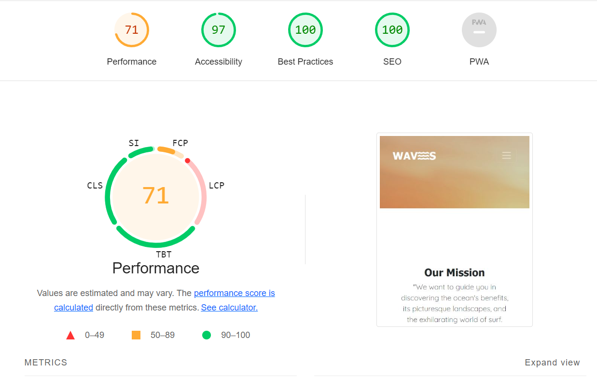

Desktop

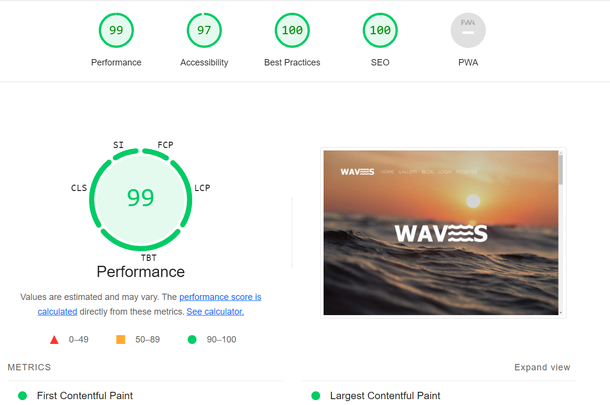

## Validation Testing

### HTML & CSS

HTML & CSS testing was completed using [W3 Validator](https://validator.w3.org/)

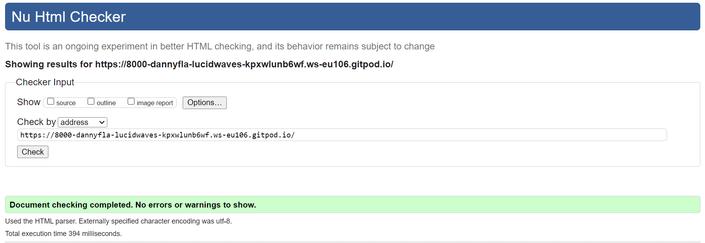

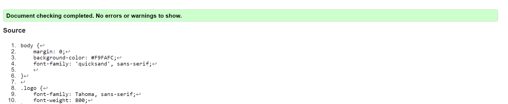

### JavaScript Testing

JavaScript testing was completed using [JSHint](https://jshint.com/)

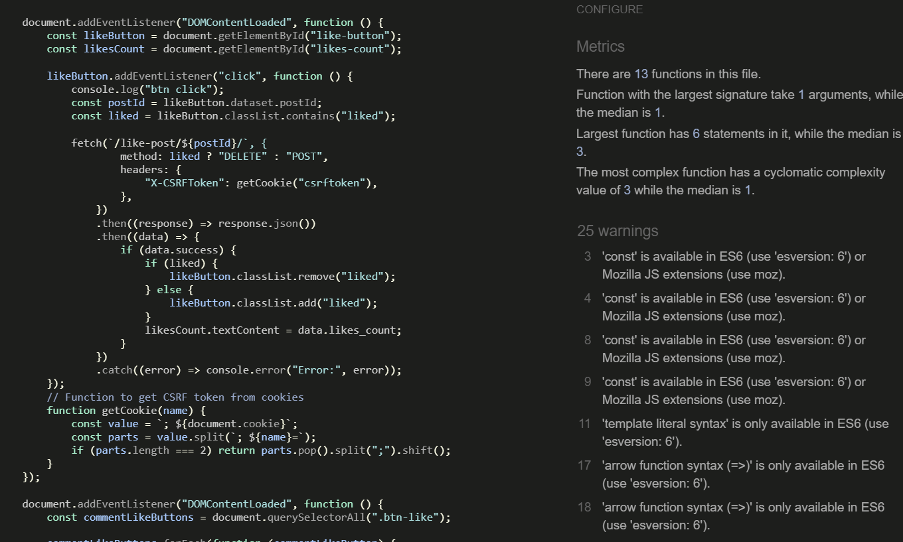

### Python Testing

Python pep8 validation was done via [Code Institute's Python Linter](https://pep8ci.herokuapp.com/)

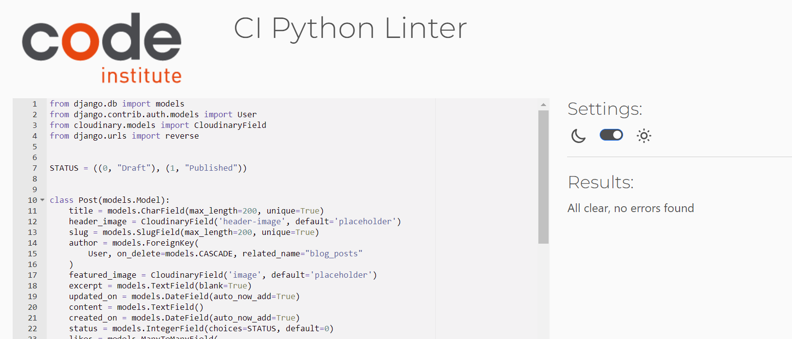

## Acknowledgments:

I extend my heartfelt thanks to AJ, my mentor, for the invaluable guidance and mentorship provided throughout the development of this project. Your insights have been instrumental in shaping its success.

A special acknowledgment goes to the tutor support team for their timely assistance and constructive feedback, contributing significantly to the project's improvement.

To my fellow students within the Slack community, thank you for fostering a collaborative learning environment through engaging discussions and shared knowledge.

I am deeply grateful to my friends and family for their unwavering support and encouragement. Your understanding has been a driving force behind the successful creation of this project.

Each of you has played a crucial role, and I am truly appreciative of the collaborative and supportive network that has surrounded this endeavor.